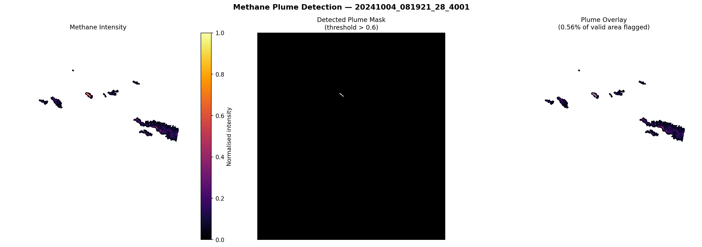

# From Space to Action: Methane Plume Detection with Tanager Hyperspectral Data

A reproducible geospatial pipeline that converts **Planet’s Tanager hyperspectral imagery** into **actionable methane plume intelligence**.

This project demonstrates how open satellite data can be transformed into **decision-ready environmental insights** through detection, extraction, and prioritization of methane emission plumes.

---

## 🌍 Overview

Methane is one of the most potent greenhouse gases, with a global warming potential significantly higher than CO₂ over short timescales. Rapid detection and localization of methane leaks is critical for:

- Climate mitigation efforts  
- Industrial monitoring  
- Environmental compliance and enforcement  

This project provides a **lightweight, transparent, and reproducible pipeline** that identifies methane plumes from hyperspectral satellite imagery and converts them into GIS-ready outputs.

---

## 🚀 Key Capabilities

- Direct access to **Tanager open STAC catalog**
- Automated download of methane-sensitive imagery (`ortho_ql_ch4`)
- Intensity-based plume detection
- Raster-to-vector conversion of plume regions
- **Plume severity classification (Low / Medium / High)**
- Export to standard geospatial formats (GeoTIFF + GeoJSON)

---

## 🛰️ Data Source and Scene

**Tanager Core Imagery (Planet Labs)**  
https://www.planet.com/data/stac/tanager-core-imagery/catalog.json

- Open-access STAC catalog  
- No authentication required  
- Static structure (no search API)
This analysis uses a methane plume scene from the Planet Tanager Open Data STAC Catalog:

- Collection: GHG-plumes  
- Item ID: 20241004_081921_28_4001  

The exact area of interest (AOI) is defined by the dataset and represents a real methane emission observation used for analysis and validation.

Navigation structure used:

```

catalog → collections → items → assets

```

Primary asset:

```

ortho_ql_ch4  (methane quicklook GeoTIFF)

````

---

## 🧠 Methodology

### 1. Data Normalization

Pixel values are scaled into a consistent range:

```python
norm = (band - band.min()) / (band.max() - band.min())
````

* Ensures comparability across scenes
* NoData values are excluded using NaN masking

---

### 2. Plume Detection

A binary mask identifies high-intensity methane regions:

```python
mask = norm > 0.6
```

* Pixels above threshold → classified as plume
* Threshold is configurable

---

### 3. Plume Extraction

* Connected plume regions are extracted using `rasterio.features.shapes`
* Small artefacts are removed using area filtering
* Output converted to GeoJSON polygons

---

### 4. Plume Intelligence (Core Contribution)

Each detected plume is analyzed and enriched with metadata:

* Mean intensity
* Maximum intensity
* Area
* Severity classification

| Category | Description                             |
| -------- | --------------------------------------- |
| High     | Strong methane signal — priority target |
| Medium   | Moderate emission                       |
| Low      | Weak or uncertain signal                |

This step transforms raw detection into **actionable intelligence**.

---

## 📦 Outputs

| File                               | Description                                     |
| ---------------------------------- | ----------------------------------------------- |
| `data/<item_id>__ortho_ql_ch4.tif` | Raw methane raster                              |
| `data/plume_mask.tif`              | Binary plume mask                               |
| `data/plumes.geojson`              | Vector polygons with intensity + classification |
| `data/plume_detection.png`         | Visualization (intensity, mask, overlay)        |

---

## 🗂 Project Structure

```
tanager/
├── data/                     # output files (git-ignored)
├── src/
│   └── main.py               # full pipeline
├── requirements.txt
└── README.md
```

---

## ⚙️ Installation

```bash
git clone <your-repo-url>
cd tanager

python -m venv .venv

# Windows
.venv\Scripts\activate

# macOS / Linux
source .venv/bin/activate

pip install -r requirements.txt
```

---

## ▶️ Execution

```bash
python src/main.py
```

---

## 📊 Output Visualization

The pipeline generates a 3-panel image:

* Methane intensity heatmap
* Binary plume mask
* Overlay visualization

Open in QGIS:

1. Add `plume_mask.tif` as raster layer
2. Add `plumes.geojson` as vector layer
3. Style polygons by `category` field

---

## 🧭 Applications

This pipeline is designed for:

* Environmental monitoring agencies
* Climate researchers
* Oil & gas regulatory bodies
* Satellite data analysts

It enables:

* Rapid methane leak detection
* Prioritized response based on severity
* Integration into GIS workflows

---

## ⚙️ Configuration

| Parameter          | Default                            | Description           |
| ------------------ | ---------------------------------- | --------------------- |
| `THRESHOLD`        | 0.6                                | Detection sensitivity |
| `MIN_AREA_PX`      | 50                                 | Noise filtering       |
| `PREFERRED_ASSETS` | `["ortho_ql_ch4", "ortho_visual"]` | Asset priority        |

---

## 📊 Sample Output

### Methane Plume Detection



This output demonstrates:

- Methane intensity distribution (heatmap)
- Binary plume detection mask
- Overlay of detected plume regions

---

### Detected Plumes (GeoJSON)

The pipeline detected **3 plume polygons** in this sample scene:

- High intensity: 2  
- Medium intensity: 1  
- Low intensity: 0  

Each plume polygon includes:

- `area`
- `mean_intensity`
- `max_intensity`
- `category` (Low / Medium / High)

File location:

## ⚠️ Limitations

* Detection is based on intensity (not full spectral inversion)
* Threshold tuning may vary across regions
* Quicklook imagery is not calibrated for precise emission quantification

---

## 🔮 Future Work

* Temporal plume tracking across multiple scenes
* Integration with atmospheric correction models
* Machine learning-based plume segmentation
* Cross-validation with EMIT / PRISMA datasets

---

## 🧪 Reproducibility

* Fully open-source
* Minimal dependencies
* No authentication required
* Single-command execution

---

## 🏁 Conclusion

This project demonstrates a complete pipeline that transforms **hyperspectral satellite data** into:

```
Detection → Extraction → Classification → Decision Support
```

A simple, scalable approach to methane monitoring using open data.
